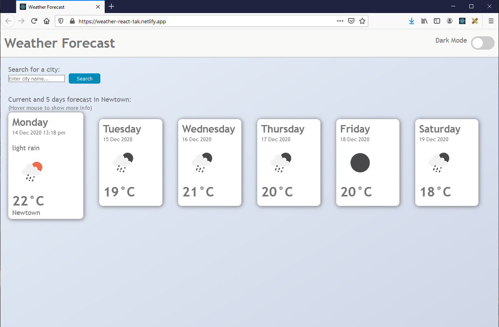
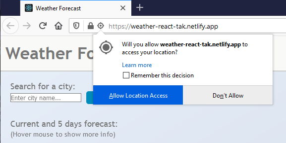

# Weather Forecast :sunny: :cloud: :umbrella: :zap: :snowman:
Weather dashboard application to show current weather and five days forecast. 

## Live demo
https://weather-react-tak.netlify.app/

## Usage
1. Open the above URL in your web browswer. 

2. The browswer requests permission to get your current location. Click **Allow Location Access** to display the weather forecast for your location.
 

3. Enter a city name in the text field and click icon (or press enter key) to search.  

4. Change "Dark Mode" if you prefer dark color theme.

## Technolgies
Following technologies are used for this application.

* HTML, CSS, JavaScript, [React](https://reactjs.org/), [GeoLocation](https://developer.mozilla.org/en-US/docs/Web/API/Geolocation_API)

## Credit 
* [Open Weather](https://openweathermap.org/api) API for providing real-time weather forecast data.

